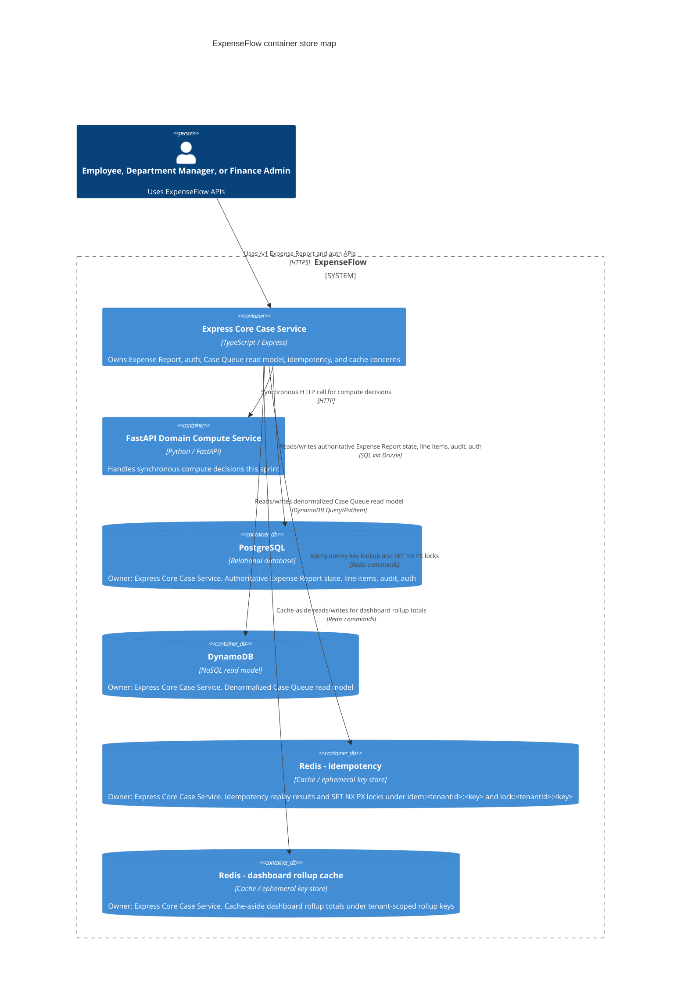

# ADR-0009: Storage per Bounded Context

## Status

Accepted.

## Context

ExpenseFlow uses PostgreSQL, DynamoDB Local, and Redis in local development. The
stores are not interchangeable: Expense Report state needs relational joins,
transactional consistency, and auditability; the Case Queue dashboard needs
tenant-scoped key reads over a denormalized read model; idempotency and dashboard
caches need short-lived keys with fast expiry.

This decision records the storage placement for the current ExpenseFlow data
concerns so future code does not add a second source of truth or move a concern
to a store that does not fit its access, consistency, join, scale, cost, or audit
requirements.

## Decision

Store authoritative Expense Report state in PostgreSQL. Store the Case Queue
read model in DynamoDB. Store idempotency replay/lock keys and cached dashboard
rollups in Redis.

### C4 container store map

This is a C4 container-level architecture map. It shows services and stores, not
Docker containers, images, ports, or deployment nodes.

Both logical containers share one physical Redis instance in local development. They are split here because they carry different eviction risk and durability expectations: idempotency keys guard request replay correctness and must not be evicted before their TTL, while dashboard rollup cache entries are disposable and safe to evict or rebuild under memory pressure. Key namespaces (`idem:`/`lock:` vs. tenant-scoped rollup keys) keep the two separable if they ever need independent eviction policies, `maxmemory` budgets, or physical separation.

### Six-factor storage matrix

#### Expense Report + line items

Store: PostgreSQL.

- Access patterns: 5/5. Tenant/id reads, transactional writes, and
  report-with-line-item listings match relational queries.
- Consistency: 5/5. Report, stage transition, and audit rows must commit
  together.
- Joins: 5/5. Line items, receipts, attachments, audit entries, and stage
  transitions are child records with foreign keys.
- Scale: 3/5. Suitable for the authoritative workflow model, but hot dashboard
  aggregates should be offloaded.
- Cost: 4/5. One durable system of record avoids duplicate write paths, with
  normal migration overhead.
- Audit: 5/5. Audit entries and stage transitions stay queryable with the case
  state they describe.

#### Per-tenant Case Queue rollup

Store: DynamoDB.

- Access patterns: 5/5. Dashboard reads are tenant-scoped key queries by stage,
  case context, and due date.
- Consistency: 3/5. Normal dashboard reads can be eventually consistent after
  PostgreSQL writes.
- Joins: 2/5. The model is deliberately denormalized and does not serve
  relational joins.
- Scale: 5/5. High-volume single-partition tenant reads and one GSI fit the
  dashboard read path.
- Cost: 4/5. Pay-per-request read model avoids repeated PostgreSQL aggregate
  scans, with sync-write cost.
- Audit: 2/5. Not an audit store; PostgreSQL remains the source of truth.

#### Idempotency key to result

Store: Redis.

- Access patterns: 5/5. `idem:<tenantId>:<key>` replay reads and
  `lock:<tenantId>:<key>` lock writes are direct key lookups.
- Consistency: 3/5. Redis protects retries during the TTL window, but replay
  state is not durable history.
- Joins: 5/5. No joins are needed for per-tenant idempotency keys.
- Scale: 5/5. Low-latency TTL keys fit concurrent POST retry traffic.
- Cost: 5/5. Automatic expiry avoids cleanup tables and scheduled pruning.
- Audit: 2/5. Useful for duplicate suppression, not for financial audit
  evidence.

#### Cached rollup/dashboard total

Store: Redis.

- Access patterns: 5/5. Cache-aside reads use one tenant-scoped key and rebuild
  on miss.
- Consistency: 2/5. Values may be stale until expiry or invalidation and must be
  recomputable.
- Joins: 5/5. Cached values are precomputed and should not require joins at read
  time.
- Scale: 5/5. Redis absorbs repeated dashboard reads for hot tenants.
- Cost: 5/5. Short TTL cache is cheaper than repeatedly recomputing dashboard
  totals.
- Audit: 1/5. Cache contents are disposable and must not be used as audit
  records.

PostgreSQL is the authoritative store for Expense Report state, line items,
constraints, stage transitions, and audit entries. Tenant isolation uses
`tenant_id` columns, tenant-scoped constraints and indexes, and repository
queries scoped from the authenticated request context.

DynamoDB is a denormalized Case Queue read model, not the source of truth for
Expense Reports. Tenant isolation uses keys derived from the authenticated
tenant scope, such as `TENANT#<tenantId>`, and every supported dashboard access
pattern must be served with a key-addressable `Query`.

Redis is ephemeral infrastructure for idempotency replay, idempotency locks, and
dashboard caching. Tenant isolation uses key prefixes that include the
authenticated tenant id. Idempotency stores successful non-5xx replay results
under `idem:<tenantId>:<key>` and in-flight locks under
`lock:<tenantId>:<key>` with `SET NX PX`. Cached dashboard values use
tenant-scoped cache keys and must be safe to delete, expire, or rebuild.

### Case Queue read cost view

The heaviest DynamoDB read in this decision is the per-tenant Case Queue rollup
lookup. This estimate is request-volume based, not storage-volume based.

Assumptions:

- 1x request volume: 3,000,000 Case Queue rollup lookups per month.
- Read shape: eventually consistent read of an item at or below 4 KB.
- Request units: 0.5 RRU per read, based on AWS DynamoDB on-demand RRU rules.
- Sample per-RRU rate: $0.125 per 1,000,000 RRUs, using the
  [AWS DynamoDB pricing page](https://aws.amazon.com/dynamodb/pricing/) US East
  on-demand read example as a sample. Confirm the current region, table class,
  discounts, and AWS pricing page before using this in a briefing.
- Cache-aside scenario: 95% Redis hit rate, so DynamoDB serves only the 5% miss
  path.

| Scenario              | DynamoDB read requests | RRU math                                               | Sample monthly read cost |
| --------------------- | ---------------------- | ------------------------------------------------------ | ------------------------ |
| 1x uncached           | 3,000,000              | 3,000,000 x 0.5 RRU x $0.125 / 1,000,000               | $0.19                    |
| 10x uncached          | 30,000,000             | 30,000,000 x 0.5 RRU x $0.125 / 1,000,000              | $1.88                    |
| 100x uncached         | 300,000,000            | 300,000,000 x 0.5 RRU x $0.125 / 1,000,000             | $18.75                   |
| 100x with cache-aside | 15,000,000             | 300,000,000 x 5% misses x 0.5 RRU x $0.125 / 1,000,000 | $0.94                    |

The 100x uncached path is still modest in this sample estimate, but it is the
first point where cache-aside materially changes the cost curve: a 95% cache hit
rate makes the DynamoDB read cost roughly twenty times cheaper. Use Redis
cache-aside at or before the 100x load multiple if dashboard traffic grows faster
than this request-volume assumption, if the live per-RRU rate is materially
higher, or if the rollup expands beyond one <= 4 KB eventually consistent read.

## Alternatives Considered

- Put all data concerns in PostgreSQL: Rejected because it would keep the source
  of truth simple, but it would make high-volume dashboard rollups and
  short-lived replay/cache keys compete with transactional workflow data.
- Put Expense Report state in DynamoDB: Rejected because the core case model
  needs joins, foreign keys, tenant-scoped relational constraints, and
  transactional audit writes.
- Put idempotency and dashboard caches in DynamoDB: Rejected because these
  concerns are short-lived key-value records where Redis expiry and lock
  semantics are a better fit.
- Treat Redis caches as durable state: Rejected because Redis values may expire
  or be evicted and are not appropriate for audit history or authoritative
  financial workflow state.

### Rejected anti-patterns

- NoSQL-as-cache: Rejected because DynamoDB should not absorb hot reads merely as
  a cache for authoritative relational state. The fix is Redis cache-aside for
  hot dashboard totals, with PostgreSQL and DynamoDB reserved for their assigned
  durable source-of-truth and read-model responsibilities.
- Cache-as-source-of-truth: Rejected because data must not live only in Redis.
  The fix is a durable store with Redis on top: Expense Report state routes back
  to PostgreSQL, and Case Queue read-model state routes back to DynamoDB.

## Consequences

POSITIVE: Expense Report state has one authoritative relational store with
transactional joins, constraints, and audit history.
POSITIVE: Case Queue dashboard reads can scale through a denormalized DynamoDB
read model while PostgreSQL remains the source of truth.
POSITIVE: Idempotency and cached dashboard totals use Redis TTL behavior instead
of adding cleanup-heavy relational tables.
NEGATIVE: PostgreSQL-to-DynamoDB synchronization must keep the Case Queue read
model fresh enough for dashboard expectations.
NEGATIVE: Redis-backed idempotency and cache entries are not durable audit
records and must be treated as ephemeral.
NEGATIVE: The architecture now has three store-specific operational paths, so
local setup and tests must keep PostgreSQL, DynamoDB Local, and Redis available
for their assigned concerns.
