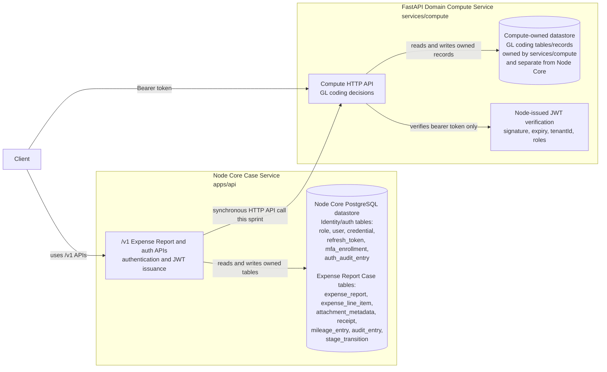

# ExpenseFlow Service Boundaries

ExpenseFlow uses two bounded contexts for the current API and compute split. Each
context owns its data model, datastore, tenant-isolation rules, and API contract.
Cross-context access happens through an API call, never by querying or writing
another context's database.

## Ownership

The **Node Core Case Service** in `apps/api` owns the Expense Report Case,
identity and auth, authentication, and JWT issuance. Its datastore is the Node
Core PostgreSQL database accessed through Drizzle. The current owned table
schemas are:

- Identity and auth: `role`, `user`, `credential`, `refresh_token`,
  `mfa_enrollment`, `auth_audit_entry`.
- Expense Report Case: `expense_report`, `expense_line_item`,
  `attachment_metadata`, `receipt`, `mileage_entry`, `audit_entry`,
  `stage_transition`.

The **FastAPI Domain Compute Service** in `services/compute` owns GL coding. Its
datastore is a separate compute-owned datastore for GL coding records. The
compute service verifies Node-issued bearer tokens, but it does not authenticate
users, issue tokens, own identity records, or query the Node Core PostgreSQL
database.

Storage placement for Expense Report state, the Case Queue read model,
idempotency keys, and dashboard caches is recorded in
[`ADR-0010`](adr/0010-storage-per-bounded-context.md).

## Tenant Isolation

Node Core isolates tenants with `tenant_id` columns, tenant-scoped constraints
and indexes, auth context from Node-issued JWTs, and tenant-scoped repository
queries. Expense Report Case and identity/auth records stay inside the Node Core
PostgreSQL datastore.

Domain Compute isolates tenants with the verified `tenantId` claim from the
Node-issued JWT and tenant-scoped GL coding records in its own datastore. The
compute service must not infer tenant membership from Node Core tables or join
against the Node Core database.

## Cross-Context Access

Node Core may call the Compute HTTP API synchronously for this sprint. Compute
may verify bearer tokens using Node-issued public-key trust material. Any future
cross-context read or write must be represented as an owning-service API
contract.

Direct database access across the boundary is forbidden. That includes direct
reads, writes, joins, migrations, tests, repair scripts, and operational fixes
against another service's datastore.
