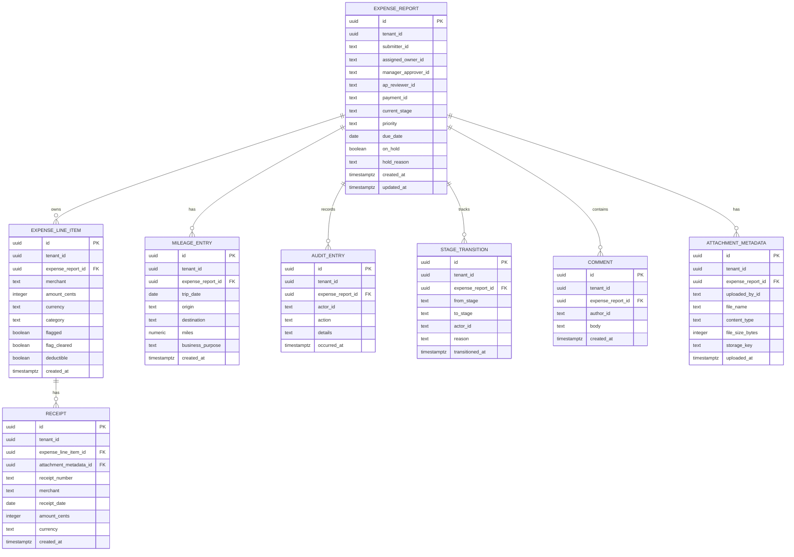

# Expense Report — relational data model

## Entities & relationships

- `expense_report` is the parent Case entity. It stores the report lifecycle in `current_stage`, not in a separate status column. Each report belongs to one tenant and includes case-level fields such as assigned owner, priority, due date, hold state, submitter, approval chain, and payment reference.
- `expense_line_item` belongs to exactly one `expense_report`; one report can have many line items. The foreign key lives on `expense_line_item.expense_report_id`.
- `receipt` belongs to exactly one `expense_line_item`; one line item can have many receipts. The foreign key lives on `receipt.expense_line_item_id`.
- `mileage_entry` belongs to exactly one `expense_report`; one report can have many mileage entries. The foreign key lives on `mileage_entry.expense_report_id`.
- `audit_entry` belongs to exactly one `expense_report`; one report can have many audit entries. The foreign key lives on `audit_entry.expense_report_id` and restricts parent deletion to preserve audit history. This table is append-only and records who did what and when.
- `stage_transition` belongs to exactly one `expense_report`; one report can have many stage transitions. The foreign key lives on `stage_transition.expense_report_id` and restricts parent deletion to preserve lifecycle history. It stores `from_stage` and `to_stage` so backward transitions to `Drafted` can be represented.
- `comment` belongs to exactly one `expense_report`; one report can have many comments. The foreign key lives on `comment.expense_report_id`.
- `attachment_metadata` belongs to exactly one `expense_report`; one report can have many attachment records. The foreign key lives on `attachment_metadata.expense_report_id`. Storage keys are unique per tenant.

Every entity carries `tenant_id` as a required first-class column so tenant isolation can be enforced at the database layer.

## ER diagram

## Normalization note

This model is in third normal form, with one deliberate tenant-isolation denormalization. Each table represents one entity type, each non-key attribute depends on the key for that table, and repeated groups such as line items, receipts, mileage entries, comments, attachments, audit entries, and stage transitions are separated into child tables instead of being stored as repeated columns on `expense_report`.

The deliberate denormalization is the repeated `tenant_id` on child tables. It exists so tenant isolation can be enforced directly on every tenant-scoped table, including database policies and tenant-scoped indexes. The sync plan is to enforce tenant consistency with composite foreign keys: report child tables store `(tenant_id, expense_report_id)` and reference `(tenant_id, id)` on `expense_report`; `receipt` stores `(tenant_id, expense_line_item_id)` and references `(tenant_id, id)` on `expense_line_item`. These constraints prevent a child row from pointing at a parent row in another tenant.

The lifecycle is intentionally stored only as `expense_report.current_stage`. It is not inferred from child rows and there is no separate status column. The `stage_transition` table records the history of movement between stages, but the current lifecycle position remains the single source of truth on the report.

The model does not store a cached report total. The total can be calculated from `expense_line_item.amount_cents` when needed, which avoids a denormalized value getting out of sync with the line items. If a cached total is added later for performance, it should be documented as deliberate denormalization and kept in sync by database triggers or a transaction that updates the report total whenever line items are inserted, updated, or deleted.

## Cardinality examples

- One synthetic Expense Report for an employee's monthly reimbursement can have three `expense_line_item` rows; each of those line items belongs to exactly that one Expense Report.
- One synthetic hotel line item can have two `receipt` rows, such as an itemized receipt and a final folio; each receipt belongs to exactly that one line item.
- One synthetic Expense Report can have two `mileage_entry` rows for separate work trips; each mileage entry belongs to exactly that one Expense Report.
- One synthetic Expense Report can have many `audit_entry` rows recording submission, approval, and AP review actions; each audit entry belongs to exactly that one Expense Report.
- One synthetic Expense Report can have several `stage_transition` rows as it moves from `Drafted` to `Submitted` to `Manager Approval`; each transition belongs to exactly that one Expense Report.
- One synthetic Expense Report can have multiple `comment` rows from a Department Manager and a Finance Admin; each comment belongs to exactly that one Expense Report.
- One synthetic Expense Report can have multiple `attachment_metadata` rows for supporting files; each attachment metadata record belongs to exactly that one Expense Report.
